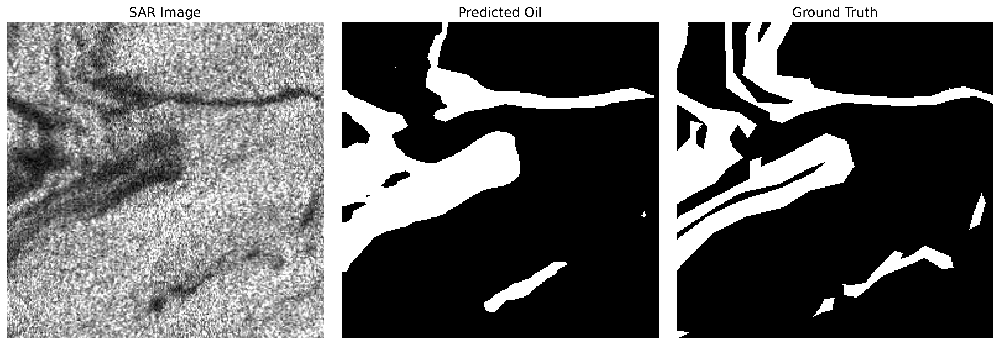
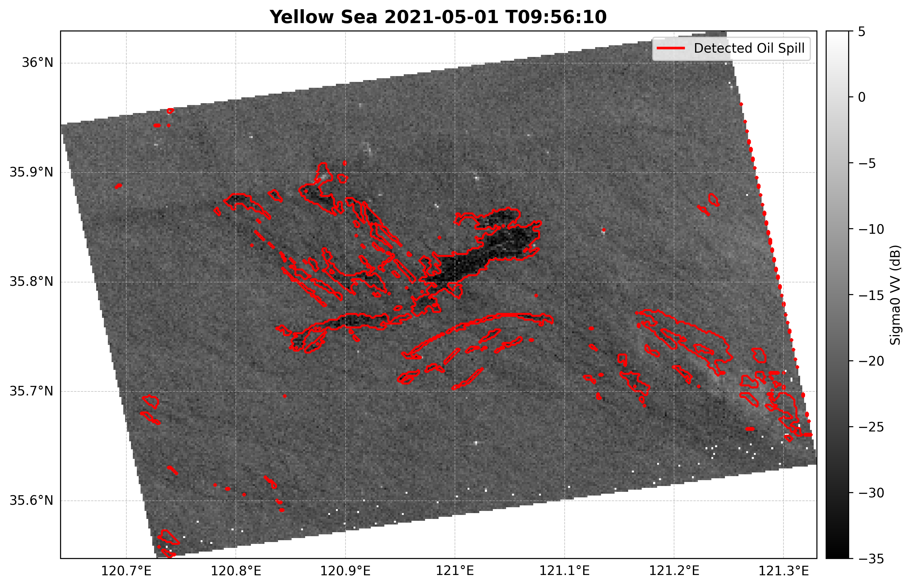
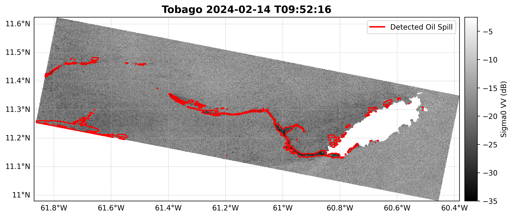
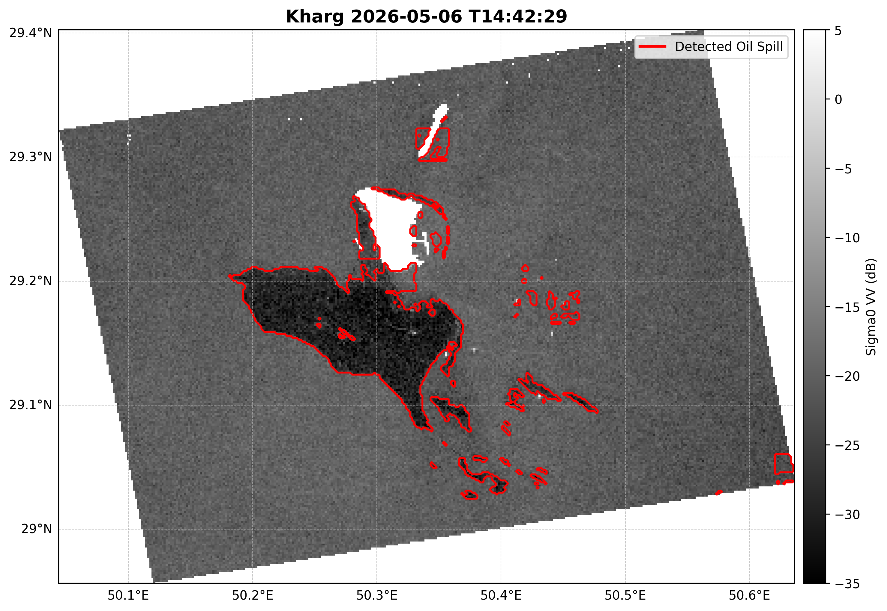
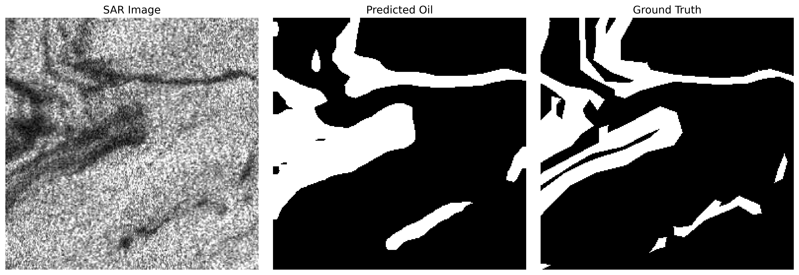
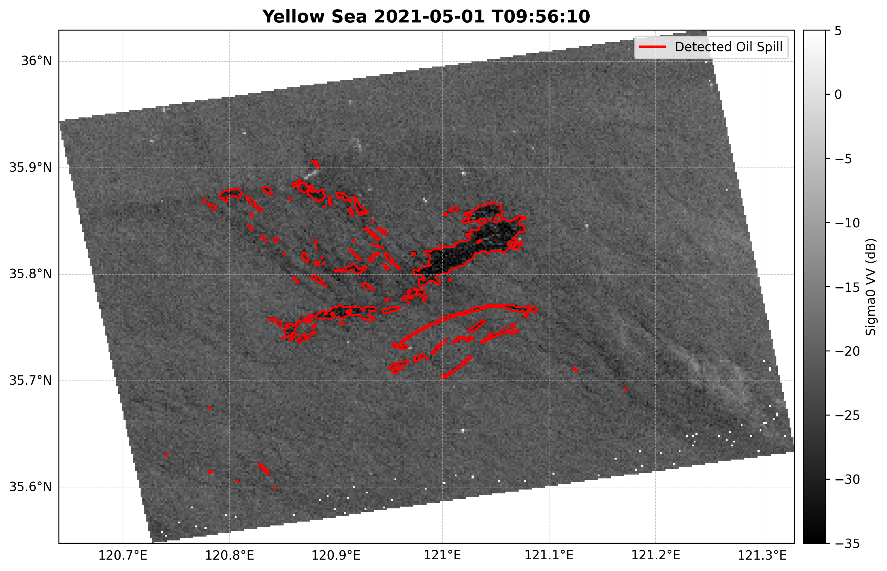
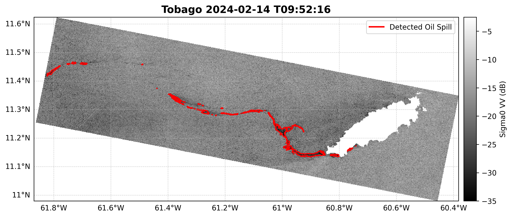
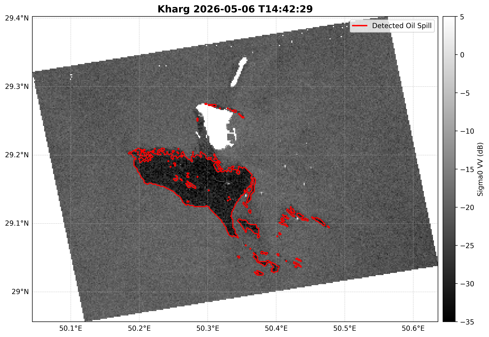

# Sentinel-1 SAR Oil Spill Detection using DeepLabV3

## Overview

This project focuses on automatic oil spill detection in Sentinel-1 Synthetic Aperture Radar (SAR) imagery using DeepLabV3 semantic segmentation.

A major challenge in SAR oil spill detection is the presence of **look-alike phenomena** such as low-wind regions, biogenic slicks, and other dark formations that resemble oil spills. This project investigates how publicly available datasets and hard-negative training samples can be used to reduce false positives while maintaining high oil spill detection performance.

## Highlights

- DeepLabV3-ResNet50 for Sentinel-1 oil spill segmentation
- Refined SOS supervised training
- Hard-negative fine-tuning using DARTIS and CSIRO OSD
- Reduced SAR look-alike false positives
- Tested on Yellow Sea, Tobago, and Kharg oil spill events

## Repository Structure

```text
SAR_Oil_Spill_Segmentation_Deeplearning/
├── scripts/
    ├── Train_refiendSOS.ipynb
    ├── Fine_tune_DARTIS_OSD.ipynb
    ├── Inference_Sentinel1.ipynb
    ├── Evaluate_model.ipynb
    └── Visualization_Sentinel1.ipynb
├── figures/
├── MATLAB/
    └── Mapping_Sentinel1.m
├── LICENSE
├── requirements.txt
├── .gitignore
└── README.md
```

---

## Objectives

* Detect oil spills from Sentinel-1 SAR imagery
* Reduce false positives caused by look-alike phenomena
* Evaluate the impact of publicly available SAR datasets on model generalization
* Apply trained models to unseen Sentinel-1 oil spill events

---

## Datasets

### Refined SOS Dataset

Primary oil spill segmentation dataset used for supervised training.

Link: https://zenodo.org/records/15298010

* Training samples: **6,455**
* Validation samples: **1,615**
* Pixel-level oil spill masks

The training dataset should be organized as:

```text
data/refined_sos/

├── images/
│   ├── train/
│   └── val/
│
└── masks/
    ├── train/
    └── val/
```
Each SAR image must have a corresponding binary oil-spill mask with the same filename.

Example:

images/train/image_001.png
masks/train/image_001.png

### DARTIS Dataset

Used as hard-negative samples.

Link: https://doi.pangaea.de/10.1594/PANGAEA.980773

Selected categories:

* NW (No Wind)
* NC (Natural Look-Alike)

Dataset statistics:

* Total negative samples: **2,290**

All samples are assigned background masks during fine-tuning.

### CSIRO OSD Dataset

Sentinel-1 SAR Oil / No-Oil Dataset used as additional negative samples.

Link: https://www.kaggle.com/datasets/harikrishnacs/sentinel-1-sar-oil-spill-detection-dataset

Dataset statistics:

* Class 0 (No Oil)
* Total samples: **3,725**

All samples are assigned background masks during fine-tuning.

---

## Model

### DeepLabV3 with ResNet-50 Backbone

* Framework: PyTorch
* Input size: 256 × 256
* Binary segmentation

Classes:

* Class 0: Background / Look-Alike
* Class 1: Oil Spill

## Generalization Experiments

The trained model was applied to several unseen Sentinel-1 oil spill events:

* Tobago oil spill (2024-02-14):
S1A_IW_GRDH_1SDV_20240214T095216_20240214T095241_052553_065B51_9268
* Yellow Sea oil tanker Symphony oil spill (2021-04-27):
S1A_IW_GRDH_1SDV_20210501T095610_20210501T095635_037693_047292_191D
* Iran Kharg oil spill (2026-05):
S1A_IW_GRDH_1SDV_20260506T144229_20260506T144254_064398_081C09_9A1F

All Sentinel-1 scenes were preprocessed using the standard SNAP workflow prior to DeepLabV3 inference. The preprocessing steps included:

1. Subset extraction
2. Thermal Noise Removal
3. Border Noise Removal
4. Radiometric Calibration
5. Refined Lee Speckle Filtering
6. Conversion to Sigma0 (dB)
7. Land Masking


This preprocessing workflow improves radiometric consistency and suppresses SAR-specific noise, enabling more reliable oil-spill detection across different Sentinel-1 acquisitions.

## Data Availability

All Sentinel-1 SAR imagery used in this study can be downloaded from:

https://dataspace.copernicus.eu/

---

## MATLAB Utilities

### Mapping_Sentinel1.m

Maps preprocessed Sentinel-1 Sigma0 VV data onto a regular longitude-latitude grid and exports:

- sigma_naught
- xx (longitude)
- yy (latitude)

The generated MAT files are directly compatible with the DeepLabV3 inference pipeline.

## Code Structure

### Train_refinedSOS.ipynb
Stage 1 baseline training using the Refined SOS dataset.

### Fine_tune_DARTIS_OSD.ipynb
Stage 2 hard-negative fine-tuning using DARTIS and CSIRO OSD datasets.

### Inference_Sentinel1.ipynb
Apply the trained model to Sentinel-1 SAR scenes.

### Visualiation_Sentinel1.ipynb
Generate georeferenced visualization figures by overlaying the DeepLabV3 oil-spill mask on Sentinel-1 Sigma0 VV imagery.

### Evaluate_model.ipynb
Evaluate a trained DeepLabV3 model on the Refined SOS validation dataset and generate quantitative performance metrics.

## Training Workflow

The model training process consists of two stages.

### Stage 1: Baseline Training

A DeepLabV3 model with a ResNet-50 backbone is trained using the Refined SOS oil-spill segmentation dataset. The model learns fundamental oil-spill characteristics from pixel-level oil-spill annotations and is evaluated on the Refined SOS validation set.

**Output:** `DeeplabV3_baseline.pth`

### Stage 2: Hard-Negative Fine-Tuning

The baseline model is further fine-tuned using hard-negative samples from the DARTIS and CSIRO OSD datasets. All DARTIS and OSD samples are assigned background masks (Class 0) and used to improve discrimination between true oil spills and SAR look-alike phenomena such as low-wind regions and natural slicks.

The fine-tuned model is again evaluated on the Refined SOS validation set to ensure that oil-spill detection performance is maintained while reducing false positives.

**Output:** `DeeplabV3_finetuned.pth`

### Training Configuration

- Network: DeepLabV3 (ResNet-50)
- Framework: PyTorch
- Classes:
  - Class 0: Background / Look-Alike
  - Class 1: Oil Spill
- Stage 1 Epochs: 10
- Stage 2 Epochs: 5

## Model Training Workflow


## Training Strategy

### Stage 1: Initial Training

The baseline DeepLabV3 model was trained using the Refined SOS dataset, which provides pixel-level oil spill annotations derived from Sentinel-1 SAR imagery.

The objective of this stage was to establish a robust oil spill segmentation model capable of learning the spectral and spatial characteristics of oil slicks without additional hard-negative samples.

Training configuration:

Network: DeepLabV3 with ResNet-50 backbone
Input size: 256 × 256 pixels
Classes:
Class 0: Background
Class 1: Oil Spill
Loss function: Cross-Entropy Loss
Optimizer: Adam
Learning rate: 1 × 10⁻⁴
Batch size: 16
Training epochs: 10

Dataset statistics:

Training samples: 6,455
Validation samples: 1,615

This baseline model achieved strong oil spill detection performance on the Refined SOS validation set. However, when applied to unseen Sentinel-1 scenes, the model frequently misclassified look-alike phenomena such as low-wind regions and naturally occurring dark formations as oil spills.

These limitations motivated the development of a second training stage incorporating hard-negative samples from external datasets.



Prediction results of the baseline DeepLabV3 model trained using only the Refined SOS dataset.
The model successfully detects major oil spill structures but remains susceptible to look-alike phenomena in unseen Sentinel-1 scenes.

### Stage 1 Result







Inference result of the baseline DeepLabV3 model trained solely on the Refined SOS dataset and applied to the Yellow Sea oil spill event (Sentinel-1, 01 May 2021), Tobago oil spill event (Sentinel-1, 14 February 2024), and Kharg oil spill event(Sentinel-1, 06 May 2026).

The baseline DeepLabV3 model trained on the Refined SOS dataset successfully detected the main oil spill structure in the Sentinel-1 scene. However, numerous false positives were observed in offshore and coastal regions due to SAR look-alike phenomena, highlighting the need for hard-negative fine-tuning using DARTIS and CSIRO OSD datasets.

### Stage 2: Fine-Tuning

Although the baseline model achieved strong performance on the Refined SOS validation set, inference on unseen Sentinel-1 scenes revealed a significant number of false positives associated with SAR look-alike phenomena.

To improve model robustness and generalization, a second training stage was introduced using hard-negative samples from publicly available SAR datasets.

The objective of this stage was not only to maintain oil spill detection capability but also to improve discrimination between true oil spills and non-oil dark formations commonly observed in SAR imagery.

Fine-tuning datasets:

Refined SOS (oil spill samples)
DARTIS hard-negative samples
NW (No Wind)
NC (Natural Look-Alike)
CSIRO OSD no-oil samples

Training strategy:

Base model:
DeepLabV3 trained on Refined SOS (Stage 1)
Fine-tuning epochs:
5 epochs
Learning rate:
1 × 10⁻⁵
Batch size:
16

Sampling ratio:

Refined SOS : DARTIS : OSD = 5 : 1 : 1

To prevent catastrophic forgetting of oil-spill features, Refined SOS samples were intentionally oversampled relative to the negative datasets. This strategy allowed the model to retain oil-spill detection capability while gradually learning to suppress look-alike false positives.

The DARTIS and CSIRO OSD samples were assigned background masks and treated as non-oil examples during training. These samples exposed the model to a broader range of SAR dark signatures that are visually similar to oil spills but do not correspond to actual contamination events.

As a result, the fine-tuned model demonstrated improved robustness when applied to unseen Sentinel-1 scenes, particularly in low-wind regions and coastal environments where look-alike phenomena frequently occur.

---

## Validation Results

Validation dataset:

* Refined SOS Validation Set
* 1,615 samples

### Performance Metrics

| Metric    | Value  |
| --------- | ------ |
| Accuracy  | 0.9283 |
| Recall    | 0.9232 |
| Precision | 0.8306 |
| F1 Score  | 0.8744 |
| IoU       | 0.7769 |
| FPR       | 0.0698 |

### Confusion Matrix

| Metric | Value      |
| ------ | ---------- |
| TP     | 26,430,179 |
| TN     | 71,820,021 |
| FP     | 5,391,495  |
| FN     | 2,198,945  |



Validation example obtained after fine-tuning the baseline DeepLabV3 model using DARTIS and CSIRO OSD hard-negative samples.

Compared with the Stage 1 baseline model, the fine-tuned model shows improved oil-spill segmentation accuracy. Several under-detected regions are better recovered, resulting in a prediction that more closely matches the ground-truth mask. In particular, the oil-spill regions in the upper-left and central-right portions of the scene are more completely detected, demonstrating improved representation of oil-spill morphology while preserving overall segmentation quality.

---

### Stage 2 Result








The fine-tuned model demonstrates substantially improved generalization on multiple unseen Sentinel-1 oil spill events. Compared with the baseline Refined SOS model, a large number of look-alike false detections are successfully suppressed, particularly in offshore regions where SAR dark formations resemble oil spills.

Importantly, the main oil-spill structure remains well preserved after fine-tuning, indicating that the model retains its oil-spill detection capability while improving discrimination against non-oil targets. Although a small reduction in detected oil area is observed in several minor regions, the overall spill morphology is maintained and the resulting detection map is considerably cleaner and more reliable.

---

## Key Findings

1. Refined SOS alone achieves strong oil spill detection performance but tends to generate false positives in look-alike regions.
2. Incorporating DARTIS and OSD hard-negative samples improves robustness against look-alike phenomena.
3. Excessive negative sampling may reduce oil spill recall.
4. A balanced fine-tuning strategy (5:1:1) provides the best trade-off between oil spill detection and false-positive suppression.

---

## Future Work

* Cross-dataset evaluation using additional SAR oil spill datasets
* Integration of polarimetric SAR features
* Transformer-based segmentation models
* Domain adaptation for global oil spill monitoring

---

## Installation

git clone https://github.com/jinhonav/Sentinel1-DeepLabV3-OilSpill.git

cd Sentinel1-DeepLabV3-OilSpill

pip install -r requirements.txt

## Notes

The provided notebooks were developed and tested in Google Colab.
Users may need to modify Google Drive paths according to their own environment.

Large Sentinel-1 scenes and training datasets are not included in this repository.
Please download the datasets from the original sources listed above.

## References

[1] Yang, Y. J., & Singha, S. (2025). Oil slicks, look-alikes and other remarkable SAR signatures in Sentinel-1 imagery in the Eastern Mediterranean Sea in 2019. PANGAEA.

[2] Blondeau-Patissier, D., Schroeder, T., Diakogiannis, F., & Li, Z. (2022). CSIRO Sentinel-1 SAR image dataset of oil- and non-oil features for machine learning.
CSIRO Data Access Portal. DOI: 10.25919/4v55-dn16

[3] Q. Zhu, Y. Zhang, Z. Li, X. Yan, Q. Guan, Y. Zhong, L. Zhang, & D. Li. (2021). “Oil Spill Contextual and Boundary-Supervised Detection Network Based on Marine SAR Images,” IEEE Transactions on Geoscience and Remote Sensing. DOI: 10.1109/TGRS.2021.3115492


## License

This project is released under the MIT License.

Datasets used in this project remain subject to their respective licenses and terms of use.

## Author

**Jinho Lee**
Satellite Oceanography Laboratory
Seoul National University
